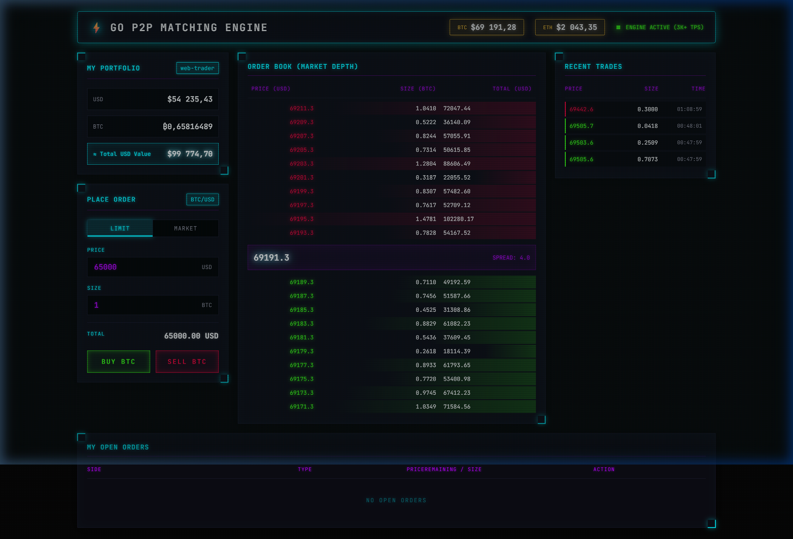
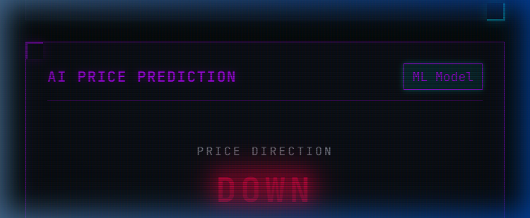

# ⚡ Go P2P Matching Engine — with AI Price Prediction

[English](#english) | [Русский](#русский)

---

<a name="english"></a>
## 🇺🇸 English

A high-performance, real-time trading engine built with **Go**, **gRPC**, and **Redis**, featuring a Cyberpunk-themed Web Terminal and **ML-powered price prediction** (CatBoost + FastAPI WebSocket).


### 🚀 Overview
A decentralized-ready P2P Matching Engine designed for high throughput and low latency. Handles Limit and Market orders, tracks real-time global prices, and provides a fully immersive trading experience with AI-driven price predictions.



### ✨ Key Features
- **High-Performance Core**: ~35,000 TPS matching engine with efficient order book data structures.
- **Real-Time Data**: Live BTC/ETH prices from Binance via integrated `PriceFetcher`.
- **Market Maker Bot**: Automated liquidity provider maintaining realistic spread.
- **AI Price Prediction**: CatBoost ML model predicting price direction in real-time via WebSocket.
- **Cyberpunk Web Terminal**: CRT scanlines, neon glows, grid overlays — full retro-future immersion.
- **Portfolio Management**: Demo balances with negative balance protection.
- **Scalable Architecture**: Decoupled components via gRPC and Redis Pub/Sub.

### 🛠 Tech Stack

| Layer | Technology |
|-------|-----------|
| **Backend** | Go (Golang) |
| **Communication** | gRPC (Protocol Buffers) |
| **Events** | Redis Pub/Sub |
| **Frontend** | Vanilla JS, CSS3 (Cyberpunk Design) |
| **ML Pipeline** | Python, CatBoost, MLflow, DVC |
| **ML Serving** | FastAPI / Starlette, WebSocket |

### 📦 Installation & Setup

1. **Clone the repository**:
   ```bash
   git clone https://github.com/poc36/go-matching-engine.git
   cd go-matching-engine
   ```
2. **Start the Go engine**:
   ```bash
   go mod download
   go run cmd/engine/main.go
   ```
3. **Start the ML inference server** (optional):
   ```bash
   cd python-ml
   python -m venv venv && venv\Scripts\activate  # Windows
   pip install -r requirements.txt
   uvicorn inference:app --port 8003
   ```
4. **Open the Terminal**:
   Navigate to `http://localhost:8080` in your browser.

### 🤖 ML Pipeline



```
collector.py → dataset.csv → train.py → model.pkl → inference.py → WebSocket → UI
```

- **Data Collection**: Polls engine's order book API at 10Hz, extracts features (spread, OBI, volatility, momentum).
- **Training**: CatBoost classifier with MLflow experiment tracking and DVC data versioning.
- **Inference**: Starlette WebSocket server broadcasting predictions at 10Hz to the trading terminal.

### 📊 Benchmark
```
Total Orders:     100,000
Throughput:       ~35,000 TPS
Average Latency:  ~275µs
```

---

<a name="русский"></a>
## 🇷🇺 Русский

Высокопроизводительный торговый движок на **Go**, **gRPC** и **Redis**, с веб-терминалом в стиле Киберпанк и **ML-предсказанием цены** (CatBoost + FastAPI WebSocket).

### 🚀 Обзор
Децентрализованный P2P движок сопоставления ордеров (Matching Engine) для высокой пропускной способности и низкой задержки. Лимитные и рыночные ордера, мировые цены в реальном времени, AI-прогноз направления цены.


### ✨ Ключевые особенности
- **Высокопроизводительное ядро**: ~35 000 TPS, эффективные структуры данных для книги ордеров.
- **Данные в реальном времени**: Актуальные цены BTC/ETH с Binance.
- **Бот маркет-мейкер**: Автоматический поставщик ликвидности.
- **AI предсказание цены**: ML-модель CatBoost прогнозирует направление цены через WebSocket.
- **Киберпанк терминал**: CRT-эффекты, неоновое свечение, ретро-футуристический дизайн.
- **Управление портфелем**: Демо-балансы с защитой от отрицательного остатка.
- **Масштабируемая архитектура**: gRPC + Redis Pub/Sub.

### 🛠 Технологический стек

| Слой | Технология |
|------|-----------|
| **Бэкенд** | Go (Golang) |
| **Связь** | gRPC (Protocol Buffers) |
| **События** | Redis Pub/Sub |
| **Фронтенд** | Vanilla JS, CSS3 (Cyberpunk) |
| **ML пайплайн** | Python, CatBoost, MLflow, DVC |
| **ML сервис** | FastAPI / Starlette, WebSocket |

### 📦 Установка и запуск

1. **Клонируйте репозиторий**:
   ```bash
   git clone https://github.com/poc36/go-matching-engine.git
   cd go-matching-engine
   ```
2. **Запустите Go-движок**:
   ```bash
   go mod download
   go run cmd/engine/main.go
   ```
3. **Запустите ML-сервис** (опционально):
   ```bash
   cd python-ml
   python -m venv venv && venv\Scripts\activate
   pip install -r requirements.txt
   uvicorn inference:app --port 8003
   ```
4. **Откройте терминал**:
   Перейдите по адресу `http://localhost:8080` в браузере.

### 🤖 ML Пайплайн


```
collector.py → dataset.csv → train.py → model.pkl → inference.py → WebSocket → UI
```

- **Сбор данных**: Опрос API книги ордеров на 10Гц, извлечение фичей (спред, OBI, волатильность, моментум).
- **Обучение**: CatBoost классификатор + MLflow трекинг экспериментов + DVC версионирование данных.
- **Инференс**: Starlette WebSocket сервер, транслирующий предсказания 10Гц в торговый терминал.

---

## 📄 License
This project is licensed under the MIT License - see the [LICENSE](LICENSE) file for details.
